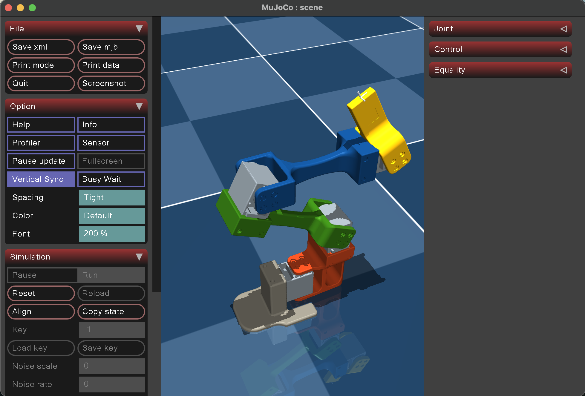

# rotom-rl

`rotom-rl` is a local MuJoCo workspace for two parallel tracks:

- A generated MuJoCo model of the Rotom mechanism exported from Onshape.
- A small reinforcement learning starter built around a separate 2D point-reacher task.

Those two tracks are not connected yet. The articulated Rotom model is present in the repo, but the current RL loop in `basline.py` trains only on `assets/point_reacher.xml`.

<div style="display: flex; justify-content: center; gap: 20px;">
  
  
</div>

## Repo Layout

- `robot.xml`: generated MuJoCo model of the Rotom mechanism.
- `scene.xml`: lightweight scene wrapper that includes `robot.xml`, lighting, and a floor plane.
- `assets/`: CAD meshes for the robot plus `point_reacher.xml`, the standalone RL task.
- `config.json`: `onshape-to-robot` export configuration for the Onshape document.
- `basline.py`: Gymnasium + Stable-Baselines3 starter script for training PPO on the point-reacher environment.
- `artifacts/`: saved PPO checkpoints such as `ppo_point_reacher.zip` and other generated outputs. This directory is gitignored.
- `justfile`: convenience recipes for regenerating the robot and launching the MuJoCo helper.
- `mujoco/`: vendored upstream MuJoCo source tree. It is not required to run `basline.py`, but it is useful for local reference and engine work.
- `mujoco_tutorial.ipynb`: local notebook for MuJoCo experimentation.

## Setup

This repo is currently set up around Python 3.12.

```bash
python3.12 -m venv .venv
./.venv/bin/python -m pip install -r requirements.txt
```

The main Python dependencies are:

- `mujoco`
- `gymnasium`
- `stable-baselines3`
- `torch`
- `onshape-to-robot`

## Working With The Rotom Model

The generated robot assets come from the Onshape document referenced in `config.json`. The usual flow is:

1. Export or refresh the MuJoCo model from Onshape.
2. Inspect the generated `robot.xml` and mesh assets in `assets/`.
3. Open the scene wrapper in MuJoCo.

Direct commands:

```bash
./.venv/bin/onshape-to-robot .
./.venv/bin/mjpython ./.venv/bin/onshape-to-robot-mujoco .
```

Optional `just` wrappers:

```bash
just onshape_api
just test_mujoco
```

Relevant files:

- `config.json` points at the Onshape assembly and overrides joint and geometry properties.
- `robot.xml` contains four actuated hinge joints: `O`, `A`, `B`, and `C`.
- `scene.xml` adds a floor plane and basic lighting around the generated robot.

## RL Starter

`basline.py` is the current executable entry point for reinforcement learning experiments. The filename is spelled `basline.py` in the repo, so the commands below use that exact path.

What the script currently does:

- Defines `PointReacherEnv`, a simple MuJoCo environment with two slide joints and a randomly placed target.
- Uses an 8D observation made from position, velocity, target position, and target delta.
- Trains PPO with Stable-Baselines3.
- Supports environment validation, random rollouts, policy evaluation, and viewer playback.

The default task file is:

```text
assets/point_reacher.xml
```

The default saved model path is:

```text
artifacts/ppo_point_reacher.zip
```

## RL Commands

Validate the environment:

```bash
./.venv/bin/python basline.py check-env
```

Run a short random rollout:

```bash
./.venv/bin/python basline.py random --steps 10
```

Train PPO:

```bash
./.venv/bin/python basline.py train --timesteps 50000
```

Evaluate a saved policy:

```bash
./.venv/bin/python basline.py eval --episodes 5
```

Open the MuJoCo viewer and watch the trained policy:

```bash
./.venv/bin/python basline.py play --episodes 3
```

Available subcommands:

- `train`
- `eval`
- `play`
- `random`
- `check-env`

## Current State

What is already working:

- `scene.xml` and `assets/point_reacher.xml` both load successfully through MuJoCo.
- `basline.py check-env` passes.
- `basline.py random` produces valid rollouts.
- `basline.py eval` can load the default checkpoint in `artifacts/ppo_point_reacher.zip`.

What is not wired up yet:

- The PPO starter does not train on `robot.xml` or `scene.xml`.
- There is no Rotom-specific Gymnasium environment yet.
- Task rewards, observations, and action spaces for the physical robot have not been defined in code.

## Suggested Next Steps

- Replace the point-mass task in `assets/point_reacher.xml` with a task built around `robot.xml` or `scene.xml`.
- Add a dedicated Rotom Gymnasium environment instead of reusing the point-reacher scaffold.
- Decide whether control should be torque-, position-, or hybrid-actuated for RL experiments.
- Formalize reward terms for task completion, energy use, smoothness, and any morphology-specific constraints.
- Rename `basline.py` to `baseline.py` later if you want cleaner ergonomics, after updating references.
